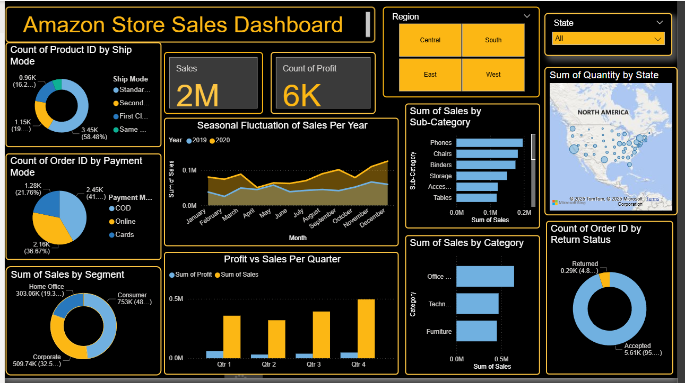

# Power BI Sales Dashboard

## Project Overview
An interactive Power BI dashboard built to analyze sales performance, customer trends, and regional insights.

## Features
- KPI cards: Total Sales, Profit, Quantity
- Monthly & Yearly trend analysis
- Region-wise and category-wise breakdown
- Interactive slicers

## Tools Used
- Power BI Desktop
- Excel / CSV Dataset
## Dashboard Preview

## File
- `Sales_Analytics_Dashboard.pbix` – Download and open using Power BI Desktop

## Author
Pranathi Vadlapudi
